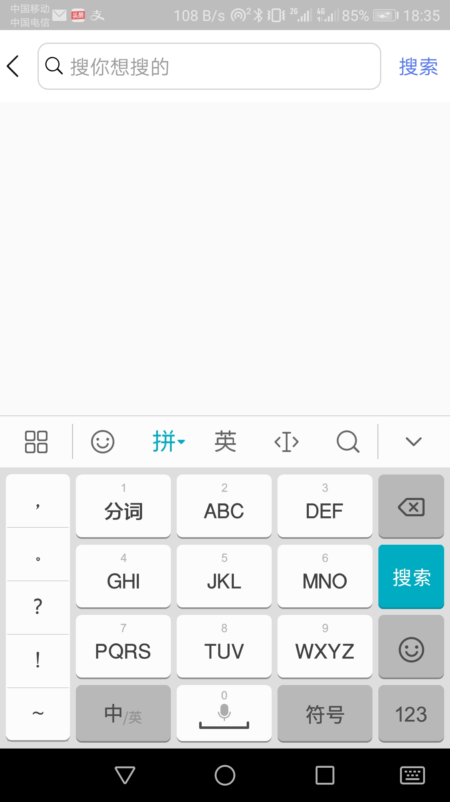
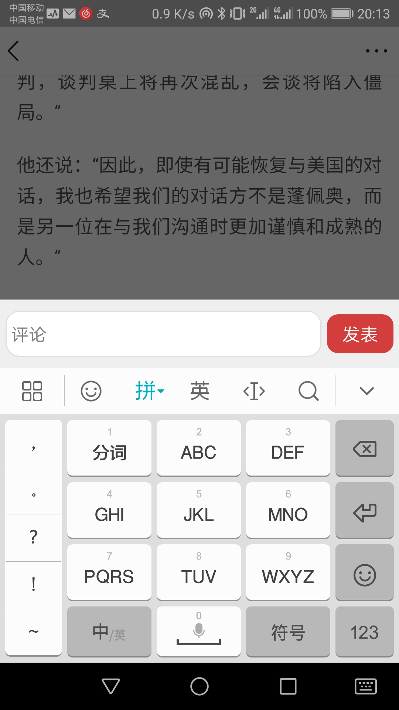
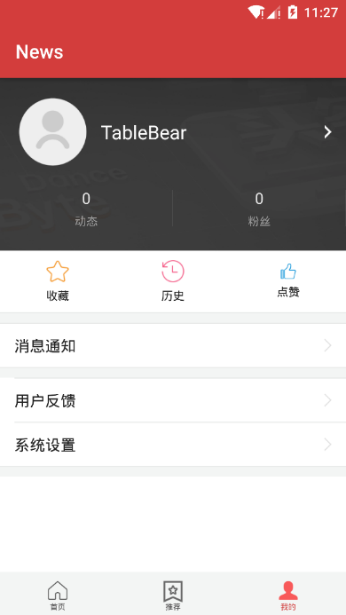

# 基于网络爬虫以及SpringBoot的新闻客户端

这是仿造今日头的新闻客户端

此项目中的新闻数据是我从上观综合、看看新闻等新闻网站上抓取下来的，如想研究新闻抓取的源码，请移步到我的另一个项目：<https://github.com/TableBear/News-Crawl>。

如想运行此项目必须配置好服务端，此项目服务端的地址为：<https://github.com/TableBear/News-Server>，搭建好服务端之后，必须修改本客户端的主请求IP地址，也即修改位于项目的com.hzx.news.api包下的ApiConstant类中的BASE_SERVER_URL属性的值。一下是对本项目的简介。

在尝试使用此项目时，如遇到任何问题，可以通过邮件联系我，邮件地址2390445347@qq.com。

1. 应用的首页

   首页主要是由搜索框+TabLayout+Fragment+BottomLayout构成，同时为了实现上拉刷新以及下拉加载更多的功能，我将Fragment用SmartRefreshLayout包裹起来。SmartRefreshLayout是一个开源项目，它实现了下拉刷新时更多的样式，更加可以自定义样式。首页还可以通过左滑和右滑切换不同的栏目。

   

2. 项目的搜索功能

   当点击了首页的搜索按钮之后，就会跳到搜索界面，在搜索框中输入你想要搜索的内容，点击搜索按钮之后即可进行搜索。搜索功能的后端我用ElasticSearch框架实现，采用中文分词器，当数据库中有标题、作者、内容与搜索关键字部分一致时就会显示成红色，如下面第二张图所示。

   

   

3. 推荐功能界面

   推荐功能界面其实与首页在页面结构上并没有什么不一样，只是请求数据的地址不一样。推荐功能是我用SVD算法实现的，它基于你以往的浏览记录，会为你推荐你可能喜欢的新闻。

   

4. 新闻详情界面

   新闻详情界面主要是由自定义的标题栏+WebView+自定义的底部栏实现的。标题栏的左箭头可以返回主页面，底部栏的可以进行评论、点赞、收藏以及分享操作。下面的第二张图就是经行评论操作的截图。

   

   

5. 个人主页

   

   

   由于本人比较懒，故简介暂且写到这，等那天有空的时候在做出补充。本项目还有许多有趣的地方，大家可以自行发掘。

